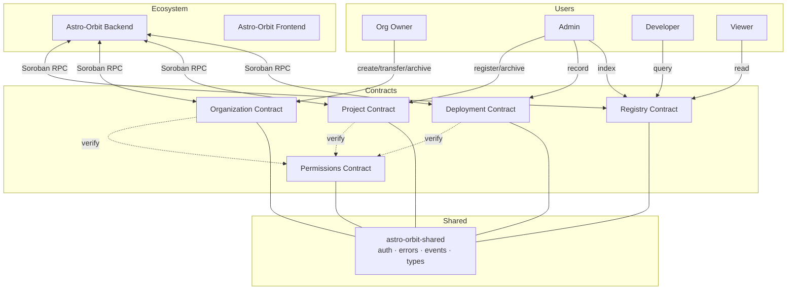

# Astro Orbit

**Contracts — Soroban smart contracts powering the Astro Orbit developer platform on the Stellar network.**

Soroban smart contracts powering the Astro Orbit developer platform on the
Stellar network. Five contracts work together to manage organizations,
projects, deployments, permissions, and on-chain registry lookups.

## Contracts

| Contract | Description | Auth |
|---|---|---|
| **Organization** | Create, transfer, update, archive orgs | Owner only |
| **Project** | Register and archive projects under orgs | Admin |
| **Permissions** | Grant/revoke roles, check permissions | Admin + User |
| **Deployment** | Record and query deployment history | Admin |
| **Registry** | Unified on-chain lookup index for all entities | Admin |

## Architecture



## Quick Start

```bash
# Build all contracts
cargo build --release

# Run all tests
cargo test

# Build WASM artifacts
cargo build --target wasm32v1-none --release
```

## Contract Dependencies

- `soroban-sdk = "27.0.0"`
- `astro-orbit-shared` (workspace member — shared auth, types, errors, events)

## Network Configuration

See [`.env.example`](./.env.example) for Soroban RPC and network passphrase
settings used when deploying or interacting with these contracts.

## Project Structure

```
contracts/
├── organization/     # org lifecycle management
├── project/          # project registration
├── deployment/       # deployment tracking
├── permissions/      # role-based access control
└── registry/         # unified on-chain index
shared/               # shared library (types, errors, events, auth)
```

## Cross-Repository Links

| Repository | Description |
|---|---|
| [Astro-Orbit Backend](https://github.com/Astro-Orbit/Astro-Orbit-backend) | REST API & Soroban RPC integration layer |
| [Astro-Orbit Frontend](https://github.com/Astro-Orbit/Astro-Orbit-frontend) | Web dashboard & developer portal |
