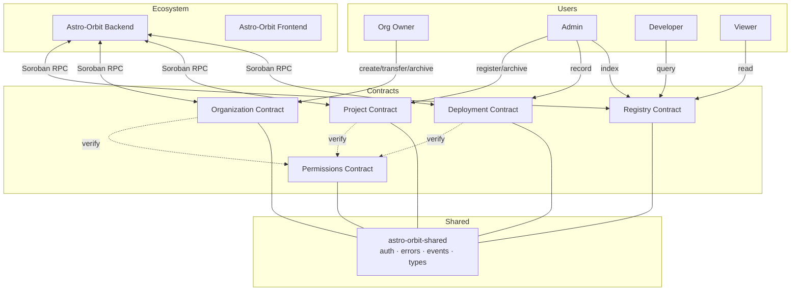

# Astro Orbit

[](https://github.com/Astro-Orbit/Astro-Orbit-contracts/actions/workflows/ci.yml)
[](LICENSE)
[](https://soroban.stellar.org)

**Contracts — Soroban smart contracts powering the Astro Orbit developer platform on the Stellar network.**

Five contracts work together to manage organizations, projects, deployments, permissions, and on-chain registry lookups — providing the on-chain foundation for the Astro Orbit platform.

## Overview

Astro Orbit Contracts provide the on-chain state layer for the platform. Each entity type (organization, project, deployment) has its own Soroban contract, while a dedicated Permissions contract handles role-based access control and a Registry contract provides a unified lookup index.

- **Organizations**: Create, transfer, update metadata, and archive — full lifecycle on-chain
- **Projects**: Register and archive projects under organizations, scoped by org ID
- **Deployments**: Record contract deployments with artifact hashes, version auto-increment, and network tracking
- **Permissions**: Grant/revoke roles per organization with hierarchical checking (owner ≥ admin ≥ developer ≥ viewer)
- **Registry**: Unified on-chain index — ingest entities from other contracts, then lookup by ID

## Features

- **On-Chain Organization Lifecycle**: Create, transfer ownership, update metadata, archive — all with authorization checks
- **Sequential Versioning**: Deployment versions auto-increment per project, providing an auditable history
- **Hierarchical RBAC**: Roles checked by numeric level — Owner (0) satisfies any check, Viewer (3) satisfies only Viewer
- **Unified Registry Index**: Backend reads from a single contract for all entity lookups, reducing RPC calls
- **Shared Library**: Common types (`OrgInfo`, `ProjectInfo`, `DeploymentInfo`, `Role`), errors, events, and auth helpers shared across all contracts
- **8 Event Types**: Every state change emits an event for off-chain indexing by the backend
- **30+ Tests**: Comprehensive test coverage across all five contracts

## Architecture



## Contracts

### Organization Contract

Manages the full lifecycle of on-chain organizations.

| Function | Parameters | Returns | Auth | Description |
|---|---|---|---|---|
| `init` | `owner: Address` | — | — | One-time setup; stores owner address. Panics on re-init |
| `create` | `org_id: u32, metadata_hash: BytesN<32>` | `Result<OrgInfo>` | Owner | Create org with `STATUS_ACTIVE`. Emits `org_created` |
| `transfer` | `org_id: u32, new_owner: Address` | `Result<OrgInfo>` | Owner | Transfer ownership. Emits `org_transferred` |
| `update_metadata` | `org_id: u32, new_hash: BytesN<32>` | `Result<OrgInfo>` | Owner | Update metadata hash |
| `archive` | `org_id: u32` | `Result<OrgInfo>` | Owner | Set `STATUS_ARCHIVED`. Emits `org_archived` |
| `get` | `org_id: u32` | `Result<OrgInfo>` | — | Read org info. Returns `NotFound` if missing |

### Project Contract

Manages project registration under organizations.

| Function | Parameters | Returns | Auth | Description |
|---|---|---|---|---|
| `init` | `admin: Address` | — | — | One-time setup. Panics on re-init |
| `register` | `project_id: u32, org_id: u32, project_hash: BytesN<32>` | `Result<ProjectInfo>` | Admin | Register project with `STATUS_ACTIVE`. Emits `project_created` |
| `archive` | `project_id: u32` | `Result<ProjectInfo>` | Admin | Set `STATUS_ARCHIVED`. Emits `project_archived` |
| `get` | `project_id: u32` | `Result<ProjectInfo>` | — | Read project info. Returns `NotFound` if missing |

### Deployment Contract

Records contract deployment history with auto-incrementing versioning.

| Function | Parameters | Returns | Auth | Description |
|---|---|---|---|---|
| `init` | `admin: Address` | — | — | One-time setup. Panics on re-init |
| `record` | `project_id: u32, contract_id: BytesN<32>, artifact_hash: BytesN<32>, network: Symbol` | `Result<DeploymentInfo>` | Admin | Auto-increments version. Emits `deployment_recorded` |
| `get` | `project_id: u32, version: u32` | `Result<DeploymentInfo>` | — | Read deployment by project + version. Returns `NotFound` |
| `count` | `project_id: u32` | `u32` | — | Total deployments for project (0 if none) |

### Permissions Contract

Role-based access control with hierarchical checking.

| Function | Parameters | Returns | Auth | Description |
|---|---|---|---|---|
| `init` | `admin: Address` | — | — | One-time setup. Panics on re-init |
| `grant_role` | `org_id: u32, user: Address, role: Role` | `Result<()>` | Admin + User | Requires auth from both. Emits `role_granted` |
| `revoke_role` | `org_id: u32, user: Address` | `Result<()>` | Admin | Removes role entry. Emits `role_revoked` |
| `has_role` | `org_id: u32, user: Address, role: Role` | `bool` | — | Hierarchical — Owner satisfies any role |
| `get_role` | `org_id: u32, user: Address` | `Result<Role>` | — | Exact role. Returns `NotFound` if none |

### Registry Contract

Unified on-chain index for all entity lookups.

| Function | Parameters | Returns | Auth | Description |
|---|---|---|---|---|
| `init` | `admin: Address, org_contract: Address, project_contract: Address, deployment_contract: Address` | — | — | One-time setup with contract addresses |
| `index_org` | `org_id: u32, info: OrgInfo` | `Result<()>` | Admin | Ingest org data from Organization contract |
| `index_project` | `project_id: u32, info: ProjectInfo` | `Result<()>` | Admin | Ingest project data from Project contract |
| `index_deployment` | `project_id: u32, version: u32, info: DeploymentInfo` | `Result<()>` | Admin | Ingest deployment data. Tracks latest version |
| `lookup_org` | `org_id: u32` | `Result<OrgInfo>` | — | Read org by ID |
| `lookup_project` | `project_id: u32` | `Result<ProjectInfo>` | — | Read project by ID |
| `lookup_deployment` | `project_id: u32, version: u32` | `Result<DeploymentInfo>` | — | Read deployment by project + version |

## Shared Library (`astro-orbit-shared`)

All contracts depend on a shared library crate providing common infrastructure.

### Types

```rust
pub struct OrgInfo {
    pub owner: Address,
    pub metadata_hash: BytesN<32>,
    pub created_at: u64,
    pub status: u32,           // 0 = ACTIVE, 1 = ARCHIVED
}

pub struct ProjectInfo {
    pub org_id: u32,
    pub project_hash: BytesN<32>,
    pub created_at: u64,
    pub status: u32,
}

pub struct DeploymentInfo {
    pub contract_id: BytesN<32>,
    pub artifact_hash: BytesN<32>,
    pub version: u32,
    pub timestamp: u64,
    pub network: Symbol,
}

pub enum Role {
    Owner = 0,
    Admin = 1,
    Developer = 2,
    Viewer = 3,
}
```

### Status Constants

| Constant | Value | Description |
|---|---|---|
| `STATUS_ACTIVE` | `0` | Entity is active and usable |
| `STATUS_ARCHIVED` | `1` | Entity is archived (read-only) |

### Role Hierarchy

```
Owner(0)  ≥  Admin(1)  ≥  Developer(2)  ≥  Viewer(3)
```

The `has_role` check compares role as `u32 ≤ requested_role as u32`:
- Owner (0) satisfies any role check
- Admin (1) satisfies Admin, Developer, Viewer
- Developer (2) satisfies Developer, Viewer
- Viewer (3) satisfies only Viewer

## Error Codes

All contracts use a single shared error enum:

| Code | Variant | Description | Resolution |
|---|---|---|---|
| 1 | `Unauthorized` | `require_auth()` failed | Use correct Stellar account |
| 2 | `AlreadyExists` | Storage key already occupied | Use a different ID |
| 3 | `NotFound` | Storage key missing on read | Verify the ID exists |
| 4 | `InvalidRole` | Role value out of range | Use a valid `Role` variant |
| 5 | `InvalidOrganization` | Organization is archived | Reactivate org first |
| 6 | `InvalidProject` | Project validation failed | Check project constraints |
| 7 | `InvalidDeployment` | Deployment validation failed | Check deployment constraints |
| 8 | `StorageFailure` | Config key missing (not initialized) | Call `init` first |
| 9 | `ValidationFailure` | General validation failure | Check input constraints |

### Error Sources by Contract

| Contract | Errors Used |
|---|---|
| Organization | `StorageFailure`, `AlreadyExists`, `NotFound`, `InvalidOrganization`, `Unauthorized` |
| Project | `StorageFailure`, `AlreadyExists`, `NotFound`, `InvalidOrganization`, `Unauthorized` |
| Deployment | `StorageFailure`, `NotFound`, `Unauthorized` |
| Permissions | `StorageFailure`, `AlreadyExists`, `NotFound` |
| Registry | `StorageFailure`, `NotFound`, `Unauthorized` |

## Events

Events are published via `env.events().publish(...)` using 8-character `symbol_short!` identifiers.

| Event | Topic Keys | Data | Emitted By | When |
|---|---|---|---|---|
| `org_created` | `("org_creat", org_id)` | `owner: Address` | `Organization::create` | New org registered |
| `org_transferred` | `("org_xfer", org_id, old_owner)` | `new_owner: Address` | `Organization::transfer` | Org ownership changed |
| `org_archived` | `("org_archv", org_id)` | `()` | `Organization::archive` | Org archived |
| `project_created` | `("proj_crea", project_id)` | `org_id: u32` | `Project::register` | New project registered |
| `project_archived` | `("proj_arch", project_id)` | `()` | `Project::archive` | Project archived |
| `deployment_recorded` | `("deploy_re", project_id)` | `version: u32` | `Deployment::record` | New deployment recorded |
| `role_granted` | `("role_grnt", org_id, user)` | `role: Role` | `Permissions::grant_role` | Role assigned to user |
| `role_revoked` | `("role_revk", org_id)` | `user: Address` | `Permissions::revoke_role` | Role removed from user |

### Event Flow

```
Organization::create    → org_created(org_id, owner)
    │
    ▼
Organization::transfer  → org_transferred(org_id, old_owner, new_owner)
Organization::archive   → org_archived(org_id)

Project::register       → project_created(project_id, org_id)
Project::archive        → project_archived(project_id)

Deployment::record      → deployment_recorded(project_id, version)

Permissions::grant_role → role_granted(org_id, user, role)
Permissions::revoke_role → role_revoked(org_id, user)
```

## Data Flow

### Organization Lifecycle

```
[ init(owner) ]
       │
       ▼
[ create(org_id, hash) ]  ──►  org_created event
       │
       ├──► [ transfer(org_id, new_owner) ]  ──►  org_transferred event
       │
       ├──► [ update_metadata(org_id, hash) ]
       │
       └──► [ archive(org_id) ]  ──►  org_archived event
```

### Deployment Flow

```
[ Backend compiles WASM ]
       │
       ▼
[ Backend submits Soroban transaction ]
       │
       ▼
[ Deployment::record(project_id, contract_id, hash, network) ]
       │
       ├──► version auto-increments
       ├──► DeploymentInfo stored
       └──► deployment_recorded event emitted
       │
       ▼
[ Backend indexes via Registry::index_deployment ]
```

### Permissions Check Flow

```
[ User calls org function ]
       │
       ▼
[ Contract calls Permissions::has_role(org_id, user, Admin) ]
       │
       ├──► Returns true  → proceed
       └──► Returns false → Unauthorized error
```

## Tech Stack

| Layer | Technology | Purpose |
|---|---|---|
| Language | Rust (edition 2021) | Smart contract development |
| SDK | Soroban SDK v27.0.0 | Stellar smart contract framework |
| Target | `wasm32v1-none` (WASM) | Blockchain execution environment |
| Testing | `#[test]` + Soroban test env | Unit and integration tests |
| Shared Lib | `astro-orbit-shared` (workspace) | Common types, errors, events, auth |
| Build | Cargo workspace (5 contracts + shared) | Unified build and dependency management |

## Project Structure

```
contracts/
├── organization/    # Org lifecycle: create, transfer, update, archive
│   ├── Cargo.toml
│   └── src/lib.rs
├── project/         # Project registration: register, archive
│   ├── Cargo.toml
│   └── src/lib.rs
├── deployment/      # Deployment records: record, get, count
│   ├── Cargo.toml
│   └── src/lib.rs
├── permissions/     # RBAC: grant_role, revoke_role, has_role, get_role
│   ├── Cargo.toml
│   └── src/lib.rs
├── registry/        # Unified index: index_*, lookup_*
│   ├── Cargo.toml
│   └── src/lib.rs
shared/              # Shared utilities
├── Cargo.toml
└── src/
    ├── lib.rs
    ├── auth.rs      # authorize(), check_active()
    ├── errors.rs    # ContractError enum
    ├── events.rs    # Event publisher functions
    └── types.rs     # OrgInfo, ProjectInfo, DeploymentInfo, Role
```

## Getting Started

### Prerequisites

- Rust 1.84+
- Soroban CLI (`cargo install soroban-cli --features opt`)
- Stellar testnet account

### Build All Contracts

```bash
cargo build --release
```

### Run All Tests

```bash
cargo test
```

30+ tests across all five contracts and the shared library.

### Build WASM Artifacts

```bash
cargo build --target wasm32v1-none --release
```

### Run Specific Contract Tests

```bash
# Organization contract
cargo test -p astro-orbit-organization

# Permissions contract
cargo test -p astro-orbit-permissions

# All contracts
cargo test --workspace
```

### Deploy to Testnet

```bash
# Deploy Organization contract
stellar contract deploy \
  --wasm target/wasm32v1-none/release/astro_orbit_organization.wasm \
  --source deployer \
  --network testnet

# Initialize
stellar contract invoke \
  --id <ORG_CONTRACT_ID> \
  --source deployer \
  --network testnet \
  -- \
  init \
  --owner <OWNER_ADDRESS>

# Repeat for Project, Deployment, Permissions, Registry contracts
```

### Initialize Registry with Contract Addresses

```bash
stellar contract invoke \
  --id <REGISTRY_CONTRACT_ID> \
  --source deployer \
  --network testnet \
  -- \
  init \
  --admin <ADMIN_ADDRESS> \
  --org_contract <ORG_CONTRACT_ID> \
  --project_contract <PROJECT_CONTRACT_ID> \
  --deployment_contract <DEPLOYMENT_CONTRACT_ID>
```

## Network Configuration

See [`.env.example`](./.env.example) for Soroban RPC and network passphrase settings.

| Variable | Default | Description |
|---|---|---|
| `SOROBAN_RPC_URL` | `https://soroban-testnet.stellar.org` | Soroban RPC endpoint |
| `STELLAR_NETWORK_PASSPHRASE` | `Test SDF Network ; September 2015` | Network passphrase |
| `DEPLOYER_SECRET_KEY` | — | Deployer account secret (keep secure!) |

## Contract Dependencies

- `soroban-sdk = "27.0.0"` — Soroban smart contract SDK
- `astro-orbit-shared` — Workspace member: shared auth, types, errors, events

## Testing

```bash
# Run all tests
cargo test

# Run with output
cargo test -- --nocapture

# Run organization-specific tests
cargo test -p astro-orbit-organization

# Run permissions-specific tests
cargo test -p astro-orbit-permissions

# Run with all features
cargo test --workspace --all-features
```

### Test Coverage Areas

- ✅ Organization: create, transfer, update, archive, get, duplicate prevention, auth checks
- ✅ Project: register, archive, get, org validation, auth checks
- ✅ Deployment: record, get, count, version auto-increment, auth checks
- ✅ Permissions: grant_role, revoke_role, has_role (hierarchical), get_role, duplicate prevention
- ✅ Registry: init, index_org, index_project, index_deployment, lookup operations
- ✅ Shared: auth helpers, event emission, error serialization

## Cross-Repository Links

| Repository | Description |
|---|---|
| [Astro-Orbit Backend](https://github.com/Astro-Orbit/Astro-Orbit-backend) | REST API & Soroban RPC integration layer |
| [Astro-Orbit Frontend](https://github.com/Astro-Orbit/Astro-Orbit-frontend) | Web dashboard & developer portal |

## Security

1. **Authorization Checks**: Every state-changing function requires `require_auth()` on the appropriate Stellar account
2. **Init Guards**: All contracts panic on re-initialization, preventing state overwrite
3. **Status Validation**: Archived organizations and projects reject state changes via `check_active()`
4. **Dual Auth**: `grant_role` requires auth from BOTH the admin and the target user, preventing unauthorized role assignments
5. **Shared Error Contract**: Consistent error handling across all contracts reduces attack surface
6. **No Unchecked Arithmetic**: Soroban SDK provides safe arithmetic; deployment versions auto-increment safely

## Roadmap

- [x] Organization contract — full lifecycle
- [x] Project contract — registration and archiving
- [x] Deployment contract — recording and versioning
- [x] Permissions contract — hierarchical RBAC
- [x] Registry contract — unified lookup index
- [x] Shared library — common types, errors, events, auth
- [x] 30+ tests across all contracts
- [ ] Contract upgrade support (Soroban native upgrades)
- [ ] Event subscription verification (off-chain proof of inclusion)

## License

MIT
